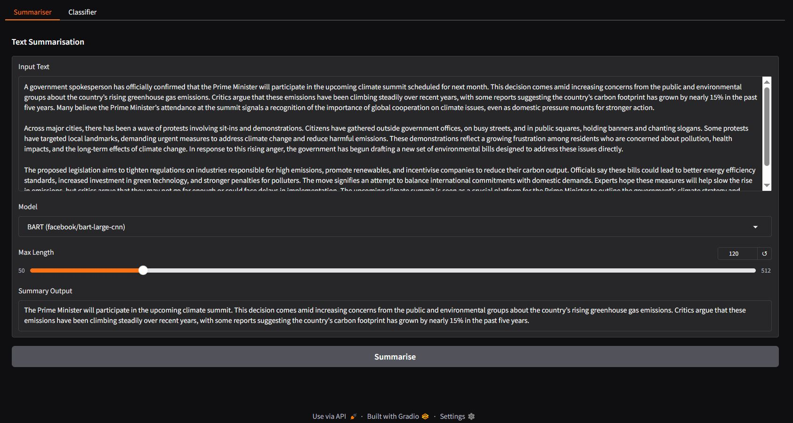
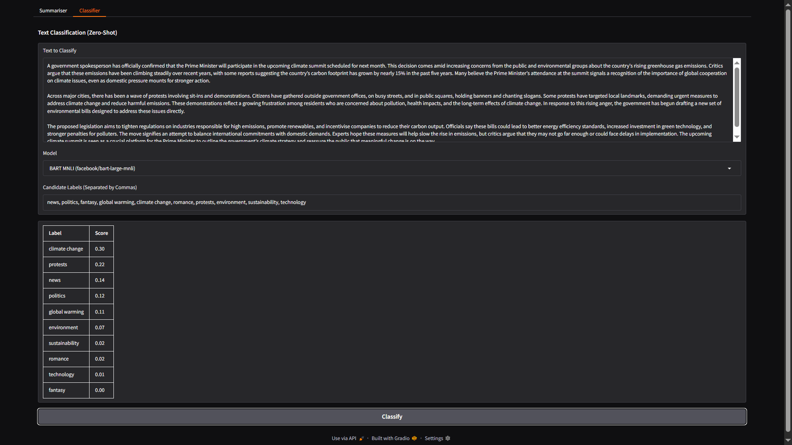

# Text Summariser & Classifier App

A simple AI-powered Gradio webapp to summarise text using HuggingFace models, and/or classify it into custom categories.

## 💻 Features
- Summarise text using multiple transformer models (T5, BART, Pegasus, etc)
- Classify text into custom labels using various models
- Clean UI with live feedback, Markdown tables, and scrollable input

## 📷 Demo



## 🛠 Tech Stack
- Python 3
- HuggingFace Transformers
- Gradio
- PyTorch

## 💡 How to Run Locally

1. Clone the repo:
    ```bash
    git clone https://github.com/SohamtheCodesmith/text-summariser-classifier.git
    cd text-summariser-classifier
    ```

2. Install dependencies:
    ```bash
    pip install -r requirements.txt
    ```

3. Run the app:
    ```bash
    python app.py
    ```

## 🧪 Sample Input


> A government spokesperson has officially confirmed that the Prime Minister will participate in the upcoming climate summit scheduled for next month. This decision comes amid increasing concerns from the public and environmental groups about the country’s rising greenhouse gas emissions. Critics argue that these emissions have been climbing steadily over recent years, with some reports suggesting the country’s carbon footprint has grown by nearly 15% in the past five years. Many believe the Prime Minister’s attendance at the summit signals a recognition of the importance of global cooperation on climate issues, even as domestic pressure mounts for stronger action.
> 
> Across major cities, there has been a wave of protests involving sit-ins and demonstrations. Citizens have gathered outside government offices, on busy streets, and in public squares, holding banners and chanting slogans. Some protests have targeted local landmarks, demanding urgent measures to address climate change and reduce harmful emissions. These demonstrations reflect a growing frustration among residents who are concerned about pollution, health impacts, and the long-term effects of climate change. In response to this rising anger, the government has begun drafting a new set of environmental bills designed to address these issues directly.
> 
> The proposed legislation aims to tighten regulations on industries responsible for high emissions, promote renewables, and incentivise companies to reduce their carbon output. Officials say these bills could lead to better energy efficiency standards, increased investment in green technology, and stronger penalties for polluters. The move signifies an attempt to balance international commitments with domestic demands. Experts hope these measures will help slow the rise in emissions, but critics argue that they may not go far enough or could face delays in implementation. The upcoming climate summit is seen as a crucial platform for the Prime Minister to outline the government’s climate strategy and reassure the public that meaningful change is on the way.


## 🧾 Sample Categories

`news, politics, fantasy, global warming, climate change, romance, protests, environment, sustainability, technology`